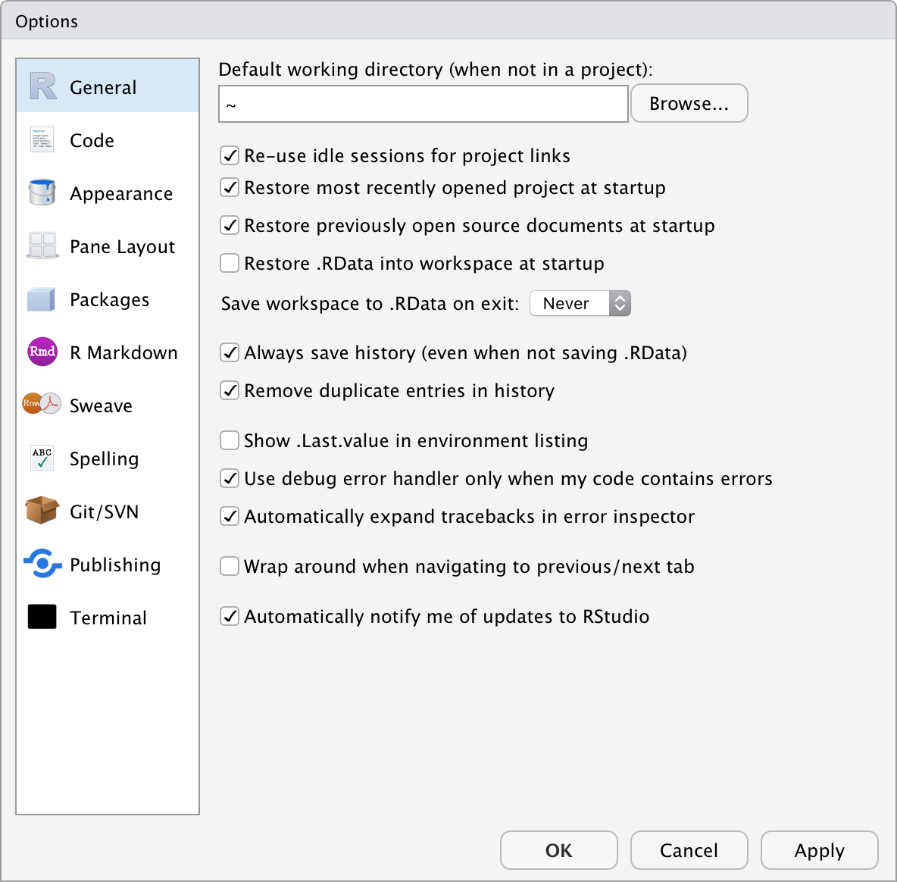

# RStudio {#rstudio}

> "Strange events permit themselves the luxury of occurring."
>
> --- Charlie Chan
  
> "Without data you're just another person with an opinion."
>
> --- W. Edwards Deming

## Setting up the workspace

### General settings

Before we start using RStudio (which is a code editor and environment that runs R) let's first set it up properly. Find the 'Tools' ('Preferences') menu item, navigate to 'Global Options' ('Code Editing') and select the tick boxes as shown in Figure \@ref(fig:RStudio-prefs).

(\#fig:RStudio-prefs)The RStudio Preferences menu.

### Customising appearance

RStudio is highly customisable. Under the **Appearance** tab under 'Tools'/'Global Options' you can see all of the different themes that come with RStudio. We recommend choosing a theme with a black background (e.g. Chaos) as this will be easier on your eyes and your computer. It is also good to choose a theme with a sufficient amount of contrast between the different colours used to denote different types of objects/values in your code. 

### Configuring panes

You cannot rearrange panes (see below) in RStudio by dragging them, but you can alter their position via the **Pane Layout** tab in the 'Tools'/'Global Options' ('RStudio'/'Preferences' – for Mac). You may arrange the panes as you would prefer however we recommend that during the duration of this workshop you leave them in the default layout.

## The Rproject
A very nifty way of managing workflow in RStudio is through the built-in functionality of the Rproject. We do not need to install any packages or change any settings to use these. Creating a new project is a very simple task, as well. For this course we will be using the `Intro_R_Workshop.Rproj` file you downloaded with the course material so that we are all running identical projects. This will prevent a lot of issues by ensuring we are doing things by the same standard. Better yet, an Rproject integrates seamlessly into version control software (e.g. GitHub) and allows for instant world class collaboration on any research project. To initialise the 'Intro_R_Workshop' project on your machine please find where you saved `Intro_R_Workshop.Rproj` file and click on it. We will cover the concepts and benefits of an Rproject more as we move through the course.

## Installing packages

