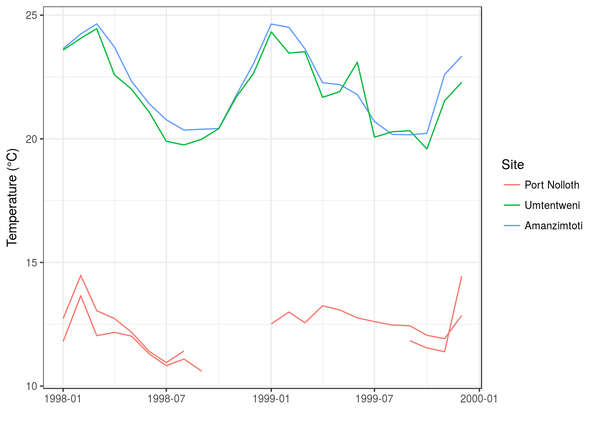

# Tidy data {#tidy}

> "Order and simplification are the first steps toward the mastery of a subject."
>
> --- Thomas Mann
  
> "Get your facts first, and then you can distort them as much as you please."
>
> --- Mark Twain


The [Tidyverse](http://tidyverse.org) is a collection of R packages that adhere to the *tidy data* principles of data analysis and graphing. The purpose of these packages is to make working with data more efficient. The core Tidyverse packages were created by Hadley Wickham, but over the last few years other individuals have added some packages to the collective, which has significantly expanded our data analytical capabilities through improved ease of use and efficiency. The Tidyverse packages can be loaded collectively by calling the **`tidyverse`** package, as we have seen throughout this workshop. The packages making up the Tidyverse are shown in Figure \@ref(fig:tidyverse).

<div class="figure" style="text-align: center">

<p class="caption">(\#fig:tidyverse)The Tidyverse by Hadley Wickham and co.</p>
</div>
  

```r
library(tidyverse)
```

As we may see in the following figure (Figure \@ref(fig:tidy)), the tidying of ones data should be the second step in any workflow, after the loading of the data.

<div class="figure" style="text-align: center">

<p class="caption">(\#fig:tidy)Data tidying in the data processing pipeline. Reproduced from [R for Data Science](http://r4ds.had.co.nz/workflow-basics.html)</p>
</div>

But what exactly are **tidy data**? It is not just a a buzz word, there is a real definition. In three parts, to be exact. Taken from Hadley Wickham's [R for Data Science](http://r4ds.had.co.nz/workflow-basics.html):

> 1.  Each variable must have its own column.  
2.  Each observation must have its own row.  
3.  Each value must have its own cell.  

This is represented graphically in figure \@ref(fig:tidy-structure). One will generally satisfy these three rules effortlessly simply by never putting more than one dataset in a file, and never putting more (or less) than one variable in the same column. We will go over this several more times today so do not fret if those guidelines are not immediately clear.

<div class="figure" style="text-align: center">

<p class="caption">(\#fig:tidy-structure)Following three rules make a dataset tidy --- variables are in columns, observations are in rows, and values are in cells. Reproduced from [R for Data Science](http://r4ds.had.co.nz/workflow-basics.html)</p>
</div>

In order to illustrate the meaning of this three part definition we are going to learn how to manipulate a non-tidy dataset into a tidy one. To do so we will need to learn a few new, very useful functions. Let's load our demo dataset to get started. This snippet from the SACTN dataset contains only data for 2008 - 2009 for three time series, with some notable (untidy) changes. The purpose of the following exercises is not only to show how to tidy data, but to also illustrate that these steps may be done more quickly in R than excel, allowing for ones raw data to remain exactly how they were collected, with all of the manipulations performed on them documented in an R script. This is a centrally important part of reproducible research.


```r
load("data/SACTN_mangled.RData")
```

With our data loaded let's now have a peek at them. We will first see that we have loaded not one, but five different objects into our environment pane in the top left our RStudio window. These all contain the exact same data in different states of disrepair. As one may guess, some of these datasets will be easier to use than others.


```r
SACTN1
SACTN2
SACTN3

# Spread across two dataframes
SACTN4a
SACTN4b
```

We start off by looking at `SACTN1`. If these data look just like all of the other SACTN data we've used thus far that's because they are. These are how tidy data should look. No surprises. In fact, because these data are already tidy it is very straightforward to use them for whatever purposes we may want. Making a time series plot, for example.


```r
ggplot(data = SACTN1, aes(x = date, y = temp)) +
  geom_line(aes(colour = site, group = paste0(site, src))) +
  labs(x = "", y = "Temperature (°C)", colour = "Site") +
  theme_bw()
```



> **`%>%`**  
Remember that this funny series of symbols is the pipe operator. It combines consequetive rows of code together so that they run as though they were one 'chunk'. We will be seeing this symbol a lot today. The keyboard shortcut for `%>%` is **ctrl shift m**. 

## Gathering and spreading

Before *tidy* became the adjective used to describe neatly formatted data, people used to say *long*. This is because well organised dataframes tend to always be longer than they are wide (with the exception of species assemblage data). The opposite of *long* data are *wide* data. If one ever finds a dataset that is wider than it is long then this is probably because the person that created them saved one variable across many columns. 

As we sit here and read through these examples it may seem odd that so much effort is being spent on something so straightforward as tidy data. Surely this is too obvious to devote an entire day of work to it? Unfortunately not. As we go out into the wild world of 'real life data', we tend to find that very few datasets (especially those collected by hand) are tidy. Rather they are plagued by any number of issues. The first step then for tidying up the data are to have a look at them and discern what are the observations that were made/recorded, and what are the variables within those observations. Let's have a look now at `SACTN2` for an example of what *wide* data looks like, and how to fix it.

### Gathering

In `SACTN2` we can see that the `src` column has been removed and that the temperatures are placed in columns that denote the collecting source. This may at first seem like a reasonable way to organise these data, but it is not tidy because the collecting source is one variable, and so should not take up more than one column. We need to `gather()` these source columns back together. We do this by telling `gather()` what the names of the columns are we want to squish together. We then tell it the name of the 'key' column. This is the column that will contain all of the old column names we are gathering. In this case we will call it 'date'. The last piece of this puzzle is the 'value' column. This is where we decide what the name of the column will be for values we are gathering up. In this case we will name it 'temp', because we are gathering up the temperature values that were incorrectly spread out by month.


```r
SACTN2_tidy <- SACTN2 %>%
  gather(DEA, KZNSB, SAWS, key = "src", value = "temp")
```

### Spreading

Should ones data be too long, meaning when individual observations are spread across multiple rows, we will need to use `spread()` to rectify the situation. This is generally the case when we have two or more variables stored within the same column, as we may see in `SACTN3`. This is not terribly common as it would require someone to put quite a bit of time into making a dataframe this way. But never say never. To spread data we first tell R what the name of the column is that contains more than one variable, in this case the 'var' column. We then tell R what the name of the column is that contains the values that need to be spread, in this case the 'val' column. Notice here that these two column names are not given in inverted commas. This is because with gather, we were creating two new columns, and so we fed them to R as character vectors (i.e. inside of inverted commas). With the spread function we are naming existing columns and so we give them to R without inverted commas.


```r
SACTN3_tidy <- SACTN3 %>% 
  spread(key = var, value = val)
```

## Separating and uniting

We've now covered how to make our dataframes longer or wider depending on their tidiness. Now we will look at how to manage our columns when they contain more (or less) than one variable, but the overall dataframe does not need to be made wider or longer. This is generally the case when one has a column with two variables, or two or more variables are spread out across multiple columns, but there is still only one observation per row. Let's see some examples to make this more clear.

### Separate

If we look at `SACTN4a` we see that we no longer have a `site` and `src` column. Rather these have been replaced by an `index` column. This is an efficient way to store these data, but it is not tidy because the site and source of each observation are separate variables. To re-create our `site` and `src` columns we must `separate()` the `index` column. First we give R the name of the column we want to separate, in this case `index`. Next we must say what the names of the new columns will be. Remember that because we are creating new column names we feed these into R within inverted commas. Lastly we should tell R how to separate the `index` column. If we look at the data we may see that the values we want to split up are separated with '/ ', so that is what we give to R. Often times the `separate()` function is able to guess correctly, but it is better to be explicit.


```r
SACTN4a_tidy <- SACTN4a %>% 
  separate(col = index, into = c("site", "src"), sep = "/ ")
```

### Unite

It is not uncommon that field/lab instruments split values across multiple columns while they are making recordings. I see this most often with date values. Often the year, month, and day values are given in different columns. There are uses for the data in this way, though it is not terribly tidy. We usually want the date of any observation to be shown in just one column. If we look at `SACTN4b` we will see that there is a `year`, `month`, and `day` column. To `unite()` them we must first tell R what we want the united column to be labelled, in this case we will use 'date'. We then list the columns to be united, her this is `year`, `month`, and `day`. Lastly we must specify if we want the united values to have a separator between them. The standard separator for date values is '-'.


```r
SACTN4b_tidy <- SACTN4b %>% 
  unite(year, month, day, col = "date", sep = "-")
```

## Joining

We will end this session with the concept of joining two different dataframes. Remember that one of the rules of tidy data is that only one complete dataset is saved per dataframe. This rule then is violated not only when additional data are stored where they don't belong, but also when necessary data are saved elsewhere. If we look back at `SACTN4a` and `SACTN4b` we will see that they are each missing different columns. Were we to **join** these dataframes together they would complete each other. The `tidyverse` provides us with several methods of doing this, but we will demonstrate here only the most common technique. The function `left_join()` is so named because it joins two or more dataframes together based on the matching of columns from the left to the right. It combines values together where it sees that they match up, and adds new rows and columns where they do not.


```r
SACTN4_tidy <- left_join(SACTN4a_tidy, SACTN4b_tidy)
```

```
R> Joining, by = c("site", "src", "date")
```

As we see above, if we let `left_join()` do it's thing it will make a plan for us and find the common columns and match up the values and observations for us best it thinks. It then returns a message letting us know what it's done. That is a pleasant convenience, but we most likely want to exert more control over this process than that. In order to specify the columns to be used for joining we must add one more argument to `left_join()`. The `by` argument must be fed a list of column names in inverted commas if we want to specify how to join our dataframes. Not that when we run this it does not produce a message as we have provided enough explicit information that the machine is no longer needing to think for itself.


```r
SACTN4_tidy <- left_join(SACTN4a_tidy, SACTN4b_tidy, by = c("site", "src", "date"))
```


## But why though?

At this point one may be wondering what the point of all of this is. Sure it's all well and good to see how to tidy one's data in R, but couldn't this be done more quickly and easily in Excel? Perhaps, yes, with a small dataset. But remember, (for many) the main reason we are learning R is to ensure that we are performing reproducible research. This means that every step in our workflow must be documented. And we accomplish this by writing R scripts.

### Writing your own functions

Writing your code into functions is key for writing neat R code and prevents repitition of code (when you have copied and pasted a piece of code twice). In my experience, young biologists are reluctant to use functions in their code and often when functions are being used they are abused and created to do too much at once. Creating a function reduces mistakes from copying and pasting and also makes updating code much easier. RStudio has several built in functions, and with more packages installed, more functions are available. Throughout this course we have continuously been making use of functions. The **tidyverse** package in itself contain several functions, such as the `mean()`, `sqrt()` and **ggplot2** functions.

A typical example of a function would be `sqrt()`. Where the argument must be a number, and the return value is the square root of that number. Executing a function is called *calling* the function. Here we *call* a built in R function.


```r
b <- sqrt(a)
```

Here, the value of `a` is given to the `sqrt()` function, the `sqrt()` function calculates the square root, and returns the value which is then assigned to the object `b`. This function is very simple, because it takes just one argument.

Now we learn to write our own basic function. The process in which we write any function, regardless of the size, is similar and involves three key steps:

- Make use of the term `function`
- Specify the arguements in that function
- Specify the body of the function


```r
my_func <- function(arg1, arg2) {
  body
}
```

`my_func` is the function name. This can be any variable name, but as previously mentioned throughout this workshop, we should avoid using names that are used in built in R functions such as `mean`, `length`, *etc*., as this may often lead to confusion and ultimately result in unnessasary errors.

`arg1` and `arg2` are the *arguements* of the function. You can write a function with any number of arguments, and some arguments may have default values specified. 

Above, 'body' denotes the function's body. This is all the code found within the { ... } brackets. The size of this code may vary depending on the required outcome. 

Once we start putting things in functions so that we can re-use them, we need to start testing that those functions are working correctly. To see how to do this, lets write a function. As mentioned earlier some arguments may have default values specified and so here I specify `y` to have a default value of 1. So, in the function call, when no value is assigned to `y` the default value will be 1.


```r
add <- function(x , y = 1) {
  x + y
}
```

Here we created a function called `add()`. This function takes two arguments, `x` and `y`, and returns the sum of `x` and `y`. Since `y` already has a default value assigned to it, it is necessary to only specify `x` in the function call; specifying `y` is optional. Since the code was 'activated' by running it through the console, the function is now available, like any other built-in functions in R, for you to use.

Now lets put our function to test:


```r
add(15) # When no y value is given it is taken as 1, as specified in the function
```

```
R> [1] 16
```

```r
add(15, 5)
```

```
R> [1] 20
```

For some practice write a function where we calculate the sum of the squares: 


```r
sum_squares <- function(x, y) {
  x^2 + y^2
}
```

Testing the function


```r
sum_squares(9, 20)
```

```
R> [1] 481
```

## Basic plotting using functions

Remember the `ChickWeight` dataset used when we explored the `ggplot()` function?. Now lets use this again. The `ChickWeight` dataset, as previously seen is a built in R dataset and so we will load this data in the usual way by using `datasets::ChickWeight`. With the `filter()` function we split the ChickWeight dataset into three different datasets based on the diet type.


```r
chicks <- datasets::ChickWeight

Diet1 <- chicks %>% 
  filter(Diet == "1")
Diet2 <- chicks %>% 
  filter(Diet == "2")
Diet3 <- chicks %>% 
  filter(Diet == "3")
```
With our three newly created datasets, we are able to create our very own function. Here we are plotting the same graph for each of the individual datasets. But why create a function to do this?. Without a function one would simply copy and paste the same code over three times. But by creating a function we are maintaining a neat coding style and avoiding repetition. 


```r
func_plot <- function(df) {
  plot1 <- df %>% 
    ggplot(aes(x = Time, y = weight)) +
    geom_point() +
    geom_smooth(method = "lm") +
    labs(x = "Days", y = "Weight (gm)", colour = "diet type") 
}
```
Lets put our function to test


```r
(diet1 <- func_plot(df = Diet1))
```


```r
(diet2 <- func_plot(df = Diet2))
```


```r
(diet3 <- func_plot(df = Diet3))
```


### Basic summary statistics function

Now that we have created our very own plotting function, lets try and create another. But here lets create a function where we use some built in functions within our function. 


```r
sum_stats <- function(df) {
  new_data <- df %>% 
    summarise(mean_wt = mean(weight),
              sd_wt = sd(weight),
              var_wt = var(weight)) 
}
```
Great! lets test this function


```r
(diet1 <- sum_stats(df = Diet1))
```

```
R>    mean_wt    sd_wt   var_wt
R> 1 102.6455 56.65655 3209.965
```

```r
(diet2 <- sum_stats(df = Diet2))
```

```
R>    mean_wt    sd_wt   var_wt
R> 1 122.6167 71.60749 5127.633
```

```r
(diet3 <- sum_stats(df = Diet3))
```

```
R>   mean_wt    sd_wt   var_wt
R> 1  142.95 86.54176 7489.476
```

## Exercise:

1. Create two vectors:
x <- c( 1, 6, 21, 19 , NA, 73, NA)
y <- c(NA, NA, 3, NA, 13, 24, NA)

a) Count the number of elements are missing in both x and y

b) Transform the code, used above (a), into a function

c) Create three new vectors and test the function created in (b)

## Bonus


1. With all of this information in hand, make use of the `laminaria` dataset and create one plotting function and one basic statistic function.

2. Create a function that calculates at least three summary statistics and run it on two different sites in the `laminaria` dataset.


